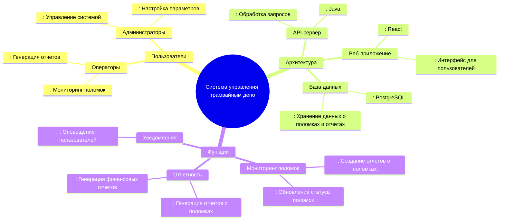

```mermaid
mindmap
  root((Система управления трамвайным депо))
    Пользователи
      Операторы
        : Мониторинг поломок
        : Генерация отчетов
      Администраторы
        : Управление системой
        : Настройка параметров
    Архитектура
      Веб-приложение
        : React
        : Интерфейс для пользователей
      API-сервер
        : Java
        : Обработка запросов
      База данных
        : PostgreSQL
        : Хранение данных о поломках и отчетах
    Функции
      Мониторинг поломок
        : Создание отчетов о поломках
        : Обновление статуса поломок
      Отчетность
        : Генерация финансовых отчетов
        : Генерация отчетов о поломках
      Уведомления
        : Оповещение пользователей

```
